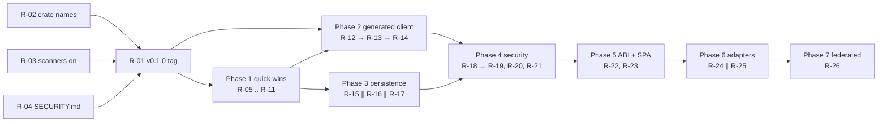

# Rust Oxide — Execution Roadmap

Goal: drive the entire backlog to zero. This document is the single ordered plan. Every item has a stable id (`R-NN`), a definition of done, and an explicit dependency on whatever must land first. Treat each `R-NN` as one PR.

Estimates use `S = ≤ 1 day`, `M = 2–5 days`, `L = 1–2 weeks`, `XL = ≥ 1 month` (solo, full-time).

**Total estimate:** ~5–7 months solo. Parallelism (Phases C / D / G are partially independent) can compress to ~3–4 months with two contributors.

---

## Phase 0 — Day-zero gates (1 week)

Foundation everything else depends on. Do these first; nothing else parallelizes around them.

| Id | Item | Effort | DoD |
|----|------|--------|-----|
| R-01 | Cut `v0.1.0` tag | S | `git tag v0.1.0 && git push --tags` triggers `release.yml`; GitHub Release artefact for every target appears; workflow ends green. `SKIP_CRATES_IO` still on. |
| R-02 | Crate-name availability sweep on crates.io | S | Run `cargo search` for every `oxide-*` name; document collisions in `CHANGELOG.md`; rename in workspace if needed (path consumers updated atomically). |
| R-03 | Enable GH Code Scanning + Secret Scanning | S | Repo settings → security → both toggled on; any baseline findings filed as `R-NN` items. |
| R-04 | Replace `SECURITY.md` placeholder | S | Real disclosure email or HackerOne/private fork-and-fix flow; CODEOWNERS routed. |

**Exit criteria:** signed release on tag, crate names confirmed, security scanners armed.

---

## Phase 1 — Quick wins (1–2 weeks, parallelizable internally)

Small, isolated improvements. Pick any order. None depend on each other.

| Id | Item | Effort | DoD |
|----|------|--------|-----|
| R-05 | `ChromiumBackend` feature-gate | S | `oxide-browser-sh` ships a `chromium` feature; default build no longer pulls `chromiumoxide`; `MockBackend` remains default-on. Tests run with `--no-default-features`. |
| R-06 | LLM token streaming | S | `OpenAiClient::complete_stream(req) -> impl Stream<Item = …>` returns SSE-decoded chunks; existing `complete` unchanged. Mock client gains a stream-of-chunks variant. |
| R-07 | LLM tool-use passthrough | M | `ChatRequest.tools: Vec<ToolSpec>` field; OpenAiClient marshals `tool_calls` in the response; `ChatResponse` exposes them. One integration test against a recorded fixture. |
| R-08 | LLM cost / rate-limit budget tracking | M | `BudgetGuard { dollars_remaining, tokens_remaining, rpm_window }` middleware around `LlmClient`; rejects with `LlmError::BudgetExceeded` past threshold. |
| R-09 | XPath selector resolution | S | `oxide-browser-sh::Selector::XPath` resolves via `document.evaluate(...)` JS shim through CDP; mock backend returns `Unsupported` (documented). |
| R-10 | MCP auto-discovery from `mcp.json` | S | `ToolRegistry::load_dir(path)` scans for `mcp.json` files emitted by `oxide-gen` and registers each as a `CliTool` pointed at the sibling binary. |
| R-11 | MCP SSE / WebSocket transports | M | `McpServer::run_sse(addr)` and `run_websocket(addr)`; share the same `handle_line` core. Cross-tested with one client per transport. |

**Exit criteria:** SDK ergonomics + LLM polish + transport breadth done. Default build size drops noticeably (chromium gated).

---

## Phase 2 — Generated client maturity (2–3 weeks)

Eliminates every `anyhow::bail!` stub from `oxide-gen`. Sequential: R-12 unlocks R-13 unlocks R-14.

| Id | Item | Effort | DoD |
|----|------|--------|-----|
| R-12 | `tonic-build` invocation during generation | M | `oxide-gen` emits a `build.rs` that runs `tonic-build::compile_protos`; generated crate compiles without manual edits when `protoc` is on PATH; `cargo run -p oxide-gen -- --spec echo.proto --output /tmp/echo && cd /tmp/echo && cargo build` is green. |
| R-13 | tonic-wired gRPC dispatch in client methods | M | Generated `Client::method(req)` calls into the tonic-generated client; `anyhow::bail!` removed. One smoke test against a tonic-mock service. |
| R-14 | GraphQL subscription streaming runtime | M | Generated `Client::subscription_X(args) -> impl Stream<Item = T>` over `graphql-ws` (WebSocket). One end-to-end test using `async-graphql` test server. |

**Exit criteria:** every operation kind (REST, GraphQL query/mutation/subscription, gRPC unary/server/client/bidi) actually executes against a real backend.

---

## Phase 3 — Persistence + live data (2–3 weeks, parallelizable: R-15 ∥ R-16 ∥ R-17)

| Id | Item | Effort | DoD |
|----|------|--------|-----|
| R-15 | On-disk `oxide-graph` adapter | M | New module `oxide-graph::persist` behind `persist` feature; SQLite-backed `GraphStore` impl; `InMemoryGraph` ↔ `PersistentGraph` interchangeable in tests via the trait. |
| R-16 | Mirror schema evolution + migrations | M | `MirrorStore::migrate_to(version)` accepts a migration registry; existing data preserved; integration test loads v1 schema, upgrades, validates. |
| R-17 | Live source subscriptions back to mirror | M | New `SyncSource::subscribe(cursor) -> impl Stream<Item = Delta>` default-implemented (poll-and-emit) with override for WebSocket sources. `Syncer` drains the stream into the store. |

**Exit criteria:** mirror durable across restarts, schema can evolve, sources can push.

---

## Phase 4 — Security hardening (3–4 weeks)

Sequence-sensitive. R-18 before R-19 (encryption first, then ACL on top).

| Id | Item | Effort | DoD |
|----|------|--------|-----|
| R-18 | Encrypted-at-rest kernel registry | M | `StateRegistry::open_encrypted(path, key)` uses SQLCipher; key handling via OS keyring (`keyring` crate) or env var; existing plain-text path still works. |
| R-19 | Capability-based bus access control | L | `MessageBus::publish` accepts a `Capability` token; `ModuleManifest` declares granted capabilities; unauthorized publish returns `KernelError::Denied`. Existing tests migrated. |
| R-20 | TLS / mTLS for `TcpMesh` | M | `TcpMesh::serve_tls(addr, cert, key)` + `connect_tls`; one end-to-end test using `rcgen`-generated test certs. |
| R-21 | Bus over TLS for cross-process kernels | M | Optional bus transport adapter speaking JSON-line + TLS for kernels-talking-to-kernels (mesh-of-meshes). |

**Exit criteria:** every cross-boundary message channel is authenticated + encrypted by default.

---

## Phase 5 — Real WASM ABI + browser depth (3–4 weeks)

| Id | Item | Effort | DoD |
|----|------|--------|-----|
| R-22 | Full WASM host ABI (JSON in / out via linear memory) | L | `WasmExecutor::call_json("method", json_in) -> json_out` round-trips via guest-exported `alloc`/`free`/`oxide_invoke`; `oxide-compress` rebuilt against this ABI; existing `i32→i32` API retained. |
| R-23 | iframe drilling + complex SPA flows | M | `ChromiumBackend::frame(name)` returns a `BrowserSession` scoped to a sub-frame; tests cover at least 2-level nested iframes + click inside a React-style SPA fixture. |

**Exit criteria:** WASM plugins are first-class kernel modules with real data exchange. Real-world SPAs are scrapable.

---

## Phase 6 — Adapters (3–5 weeks, mostly parallel)

| Id | Item | Effort | DoD |
|----|------|--------|-----|
| R-24 | Neo4j `GraphStore` adapter | L | `oxide-graph::neo4j::Neo4jGraph` behind `neo4j` feature; integration test against a `docker run neo4j:5` container in CI (skipped locally without docker). |
| R-25 | libp2p transport for `oxide-mesh` | L | `oxide-mesh::libp2p::Libp2pMesh` behind `libp2p` feature; gossipsub + Kademlia bootstrap; one end-to-end test pairing two nodes via memory transport. |

**Exit criteria:** users can opt into a real graph DB and a real P2P stack without rewriting agent code.

---

## Phase 7 — Federated learning (1 month+, single XL effort)

| Id | Item | Effort | DoD |
|----|------|--------|-----|
| R-26 | New crate `oxide-fed` | XL | Defines `ModelWeights` CRDT (per-parameter `LwwRegister<f32>` or vector merge); `Aggregator::round(local_grad) -> global_weights`; trains a toy MNIST CNN across 3 peers using the mesh transport and demonstrates convergence within 2× single-node baseline. |

**Exit criteria:** Rust Oxide can run a real federated-learning round end-to-end without leaving the SDK.

---

## Dependency graph

Phases 1 / 3 can overlap. Phase 6 can overlap with the tail of Phase 5.

---

## Execution mechanics

**Per-item workflow:**

1. `gh issue create --title "R-NN: <item>"` referencing this file.
2. Branch `r-NN-<slug>`. One PR per item, ≤ 400 LOC diff where possible.
3. PR body links the DoD bullets above and pastes the CI run.
4. Merge → tick the item below.
5. When all items in a phase close, cut a release tag (`v0.2.0` end of Phase 1, etc.).

**Progress checklist** — copy this section into a tracking issue and check off as items land.

- Phase 0: [ ] R-01 [x] R-02 [ ] R-03 [x] R-04
- Phase 1: [x] R-05 [x] R-06 [x] R-07 [x] R-08 [x] R-09 [x] R-10 [ ] R-11
- Phase 2: [ ] R-12 [ ] R-13 [ ] R-14
- Phase 3: [ ] R-15 [ ] R-16 [ ] R-17
- Phase 4: [ ] R-18 [ ] R-19 [ ] R-20 [ ] R-21
- Phase 5: [ ] R-22 [ ] R-23
- Phase 6: [ ] R-24 [ ] R-25
- Phase 7: [ ] R-26

When every box is ticked, the backlog is empty and Rust Oxide is at `v1.0`.

---

## Risk register

| Risk | Likelihood | Mitigation |
|------|-----------:|------------|
| Crate names taken on crates.io | medium | R-02 first; pivot to `oxide-rs-*` prefix if collisions block |
| `tonic-build` requires `protoc` system binary | high | document install path in `oxide-gen` README; CI installs it via `apt-get`/`brew` |
| Neo4j integration test flaky in CI | medium | run on schedule, not on every push; skip without docker |
| libp2p compile-time bloat | medium | hard feature-gate; default off |
| Federated learning scope creep | high | restrict R-26 to one toy model; defer real workloads to v2.x |
| GitHub Code Scanning surfaces new alerts | medium | each finding becomes its own `R-NN` patch issue |

---

## When the backlog hits zero

- Promote to `v1.0.0`.
- Move this roadmap to `docs/HISTORY.md` and start a fresh `docs/ROADMAP.md` for the next horizon (e.g. distributed-agent scheduling, vector DB integration, observability stack).
