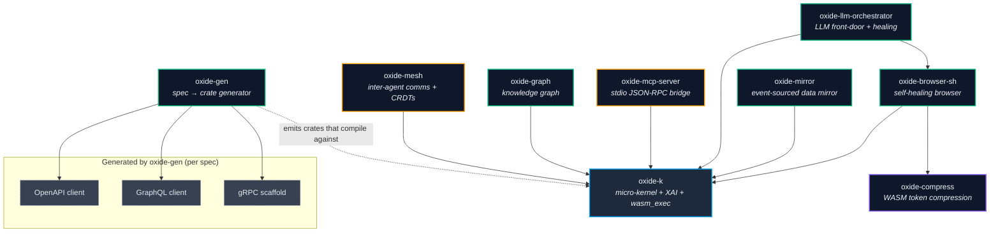
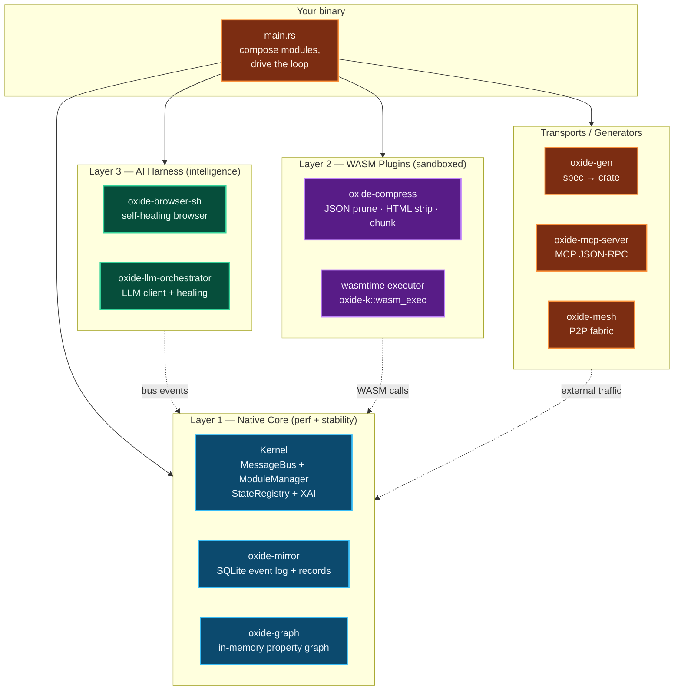
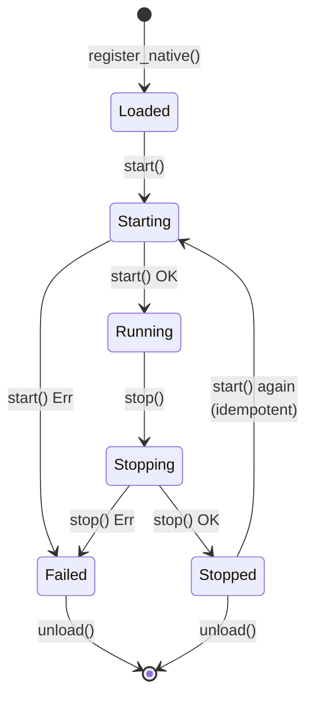
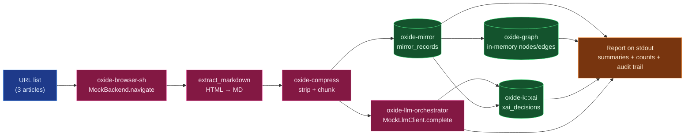
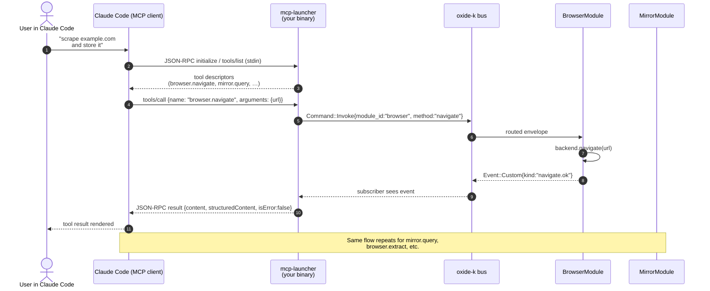
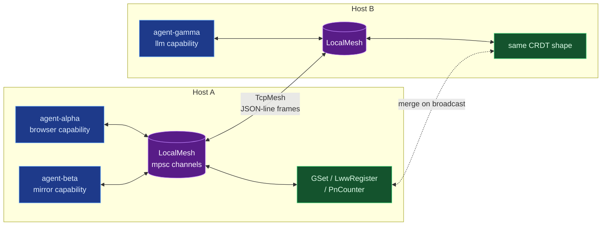

# Rust Oxide — Architecture

Five Mermaid views. Read top-to-bottom for a complete mental model.

---

## 1. Crate dependency graph

How the nine workspace crates fit together. Every arrow is a direct `Cargo.toml` dependency.

The kernel is the single hub. Layer 2 / tooling crates depend on it but not on each other (with two exceptions: `oxide-browser-sh` pipes extracted Markdown through `oxide-compress`; `oxide-llm-orchestrator` healing strategy implements `oxide-browser-sh`'s `HealingStrategy` trait).

---

## 2. Layered architecture (spec model)

The three execution layers from the original Rust Oxide spec, with concrete crates assigned to each.

---

## 3. Message bus + module lifecycle

Every module is just a `Module` trait impl whose lifecycle hooks are driven by the kernel. Bus messages flow through `MessageBus` as `Envelope { source, correlation_id, timestamp, message }`.

```mermaid
sequenceDiagram
    autonumber
    actor Caller as Caller (your code)
    participant Bus as MessageBus
    participant MM as ModuleManager
    participant Mod as Module impl<br/>(browser / mirror / llm / …)

    Caller->>MM: register_native(module)
    MM->>Mod: init(bus.clone())
    Note over Mod: module subscribes to bus,<br/>spawns listener task
    Caller->>MM: start("module_id")
    MM->>Mod: start()
    MM-->>Bus: emit Event::ModuleStarted

    rect rgb(40, 60, 90)
        Note over Caller,Mod: Steady state — agent loop
        Caller->>Bus: send_command(Invoke{module_id, method, payload})
        Bus->>Mod: envelope routed to subscriber
        Mod->>Mod: dispatch(method, payload)
        Mod-->>Bus: emit Event::Custom{kind: "<method>.ok", payload}
        Bus-->>Caller: subscriber sees event
    end

    Caller->>MM: stop("module_id")
    MM->>Mod: stop() (abort listener)
    MM-->>Bus: emit Event::ModuleStopped
```

### Lifecycle state machine

---

## 4. End-to-end data flow — `news-agent` example

Concrete pipeline from `rust-oxide-lib/examples/news-agent`. Shows how seven crates collaborate.

Swap `MockBackend → ChromiumBackend` and `MockLlmClient → OpenAiClient` to point the same pipeline at the live web — no other code changes.

---

## 5. MCP integration — Claude Code talking to Rust Oxide

How an external agent runtime (Claude Code, Cursor, any MCP client) invokes Rust Oxide capabilities.

---

## 6. Inter-agent fabric — `oxide-mesh` topology

Multiple agents federating across processes / hosts.

Messages flow as `PeerMessage::{Hello, Broadcast, Direct, Task, Result}`. CRDTs converge on every merge regardless of arrival order.

---

## Reading these diagrams

- Boxes coloured by **role**, not by depth — kernel / Layer 2 / Layer 3 / transport.
- Solid arrows = synchronous calls or direct deps.
- Dashed arrows = bus events or async fan-out.
- Cylinders = persistent stores (SQLite tables, in-memory graphs, XAI log).

For the source-of-truth tables (every bus method, every module's payload shape), see the per-crate docs at `cargo doc --workspace --no-deps --open` and the [`USAGE.md`](../USAGE.md) recipes.
